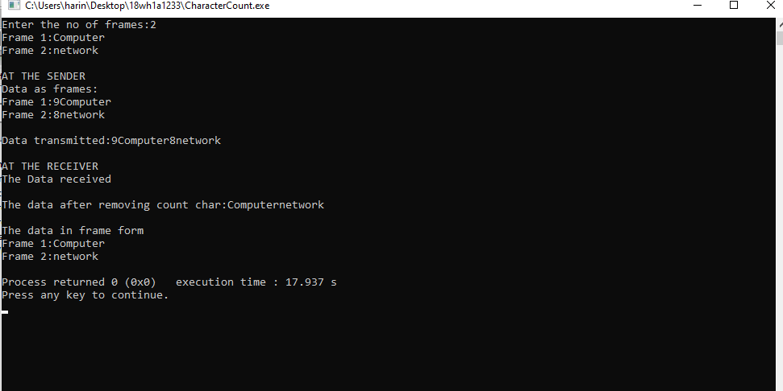
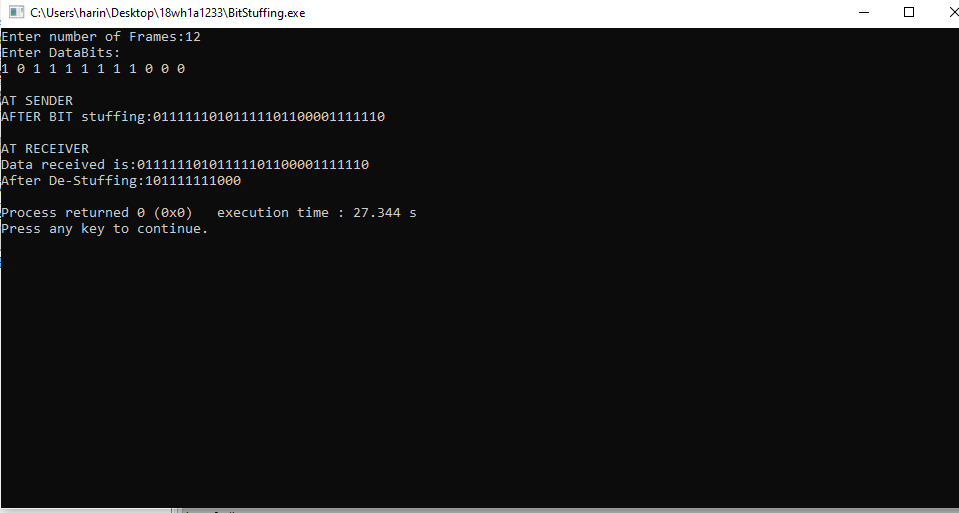
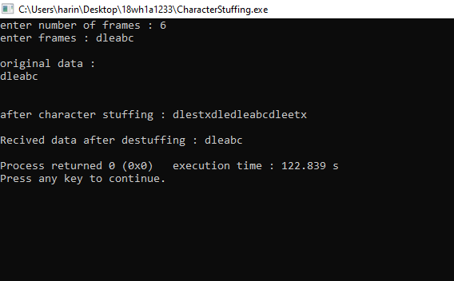

## Aim of the Experiment
To impliment data link layer framing techniques such as

i.character count ii. character stuffing and iii. bit stuffing

### step by step procedure of experiment

###CharacterCount

1.First scan the number of the frames

2.Find the length of each frames

3.Print Frames at Sender.

4.Print the Data Transmitted.

###Bit Stuffing

1.Bit stuffing is the insertion of non info bits into data.

2.The stuffed bits should not get confused with overhead bits.

3.Use the two-character sequence 01111110 to signal beginning of the frame,and the sequence 01111110 to flag frame's end.

4.Use charater stuffing within the frame.

5.Replace every occurrence of 11111 with the 0.

###Charcter Stuffing

1.Use the two-character sequence DLE STX(Data Link Escape,Start of TeXt) to flag the frame's end.

2.Use character stuffing within the frame 

3.Replace every occurrence of DLE with the two-character sequence DLE DLE.

4.The receiver reverses the processes,replacing every occurrence of DLE DLE with a single DLE.

### Output

###Character Count :

###Bit Stuffing:

###Character Stuffing:

